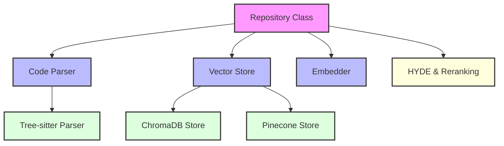
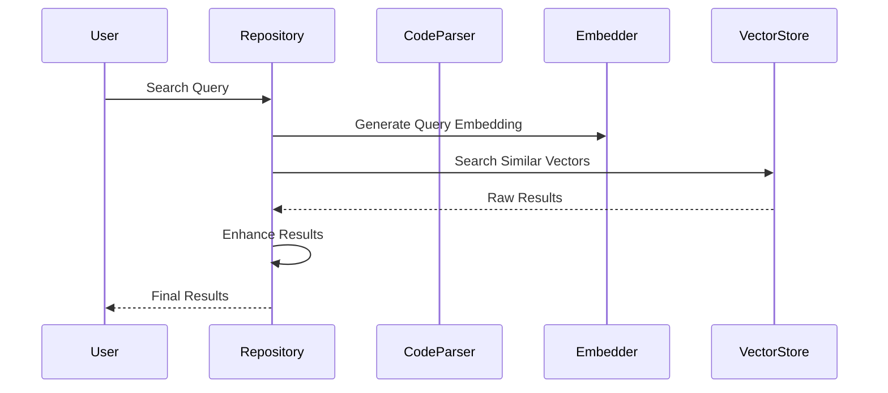
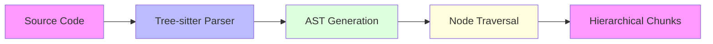
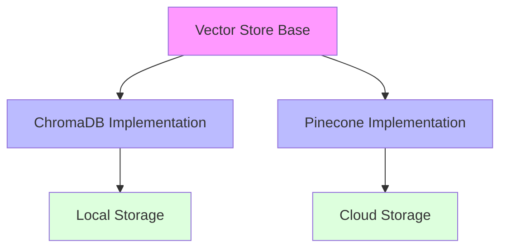
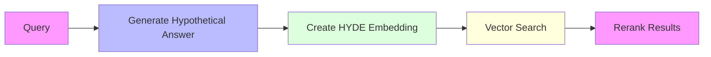

# CodeRAG: A Hierarchical Code Search and Understanding System

## Architecture Overview



## Component Breakdown

### 1. Repository Class

The central orchestrator that coordinates all components:

- Manages code indexing
- Handles search requests
- Coordinates between parser, embedder, and vector store



### 2. Code Parser & Tree-sitter

#### How Tree-sitter Works



Tree-sitter parsing process:

1. **Lexical Analysis**: Converts source code into tokens
2. **AST Generation**: Creates Abstract Syntax Tree
3. **Node Identification**: Recognizes classes, methods, functions
4. **Hierarchical Extraction**: Maintains parent-child relationships

Example of hierarchical chunking:

```python
# Input Code
class UserManager:
    def validate_user(self, user_id):
        pass
    def create_user(self, user_data):
        pass

# Chunking Result
1. Class Chunk:
   - Type: class
   - Name: UserManager
   - Children: [validate_user, create_user]

2. Method Chunks:
   - Type: method
   - Name: validate_user
   - Parent: UserManager

3. Method Chunks:
   - Type: method
   - Name: create_user
   - Parent: UserManager
```

### 3. Vector Store System



#### Search Process

1. **Query Embedding**: Convert search query to vector
2. **Vector Search**: Find similar code embeddings
3. **Result Enhancement**: Add hierarchical context
4. **Score & Sort**: Rank results by relevance

### 4. HYDE and Reranking



## Example Usage

### Basic Search

```python
from coderag import Repository, ChromaDBStore

# Initialize
vector_store = ChromaDBStore(collection_name="my_repo")
repo = Repository(
    repo_path="./my_code",
    vector_store=vector_store
)

# Search
results = repo.search("function to validate user input")
```

### Search Results Structure

```python
{
    'id': 'unique_id',
    'score': 0.85,
    'metadata': {
        'type': 'method',
        'name': 'validate_user',
        'parent': 'UserManager',
        'file_path': 'src/users.py',
        'start_line': 10,
        'end_line': 20,
        'content': '...',
        'summary': 'Validates user input data'
    }
}
```

### Enhanced Results Example

Let's look at how results are enhanced with hierarchical context:

````python
# Sample Code Structure
class AuthenticationManager:
    def validate_credentials(self, username, password):
        """Validates user credentials against database"""
        return self._check_password(username, password)

    def _check_password(self, username, password):
        """Internal method to verify password hash"""
        pass

# Search Query: "password validation"
# Results will include:

1. Direct Match:
```python
{
    'id': 'method_001',
    'score': 0.92,
    'metadata': {
        'type': 'method',
        'name': '_check_password',
        'parent': 'auth_manager_001',
        'file_path': 'auth/manager.py',
        'start_line': 8,
        'end_line': 10,
        'content': '    def _check_password(self, username, password):\n        """Internal method to verify password hash"""\n        pass',
        'docstring': 'Internal method to verify password hash',
        'included_as_context': False
    }
}
````

2. Parent Context (Automatically Included):

```python
{
    'id': 'auth_manager_001',
    'score': 0.75,
    'metadata': {
        'type': 'class',
        'name': 'AuthenticationManager',
        'file_path': 'auth/manager.py',
        'start_line': 1,
        'end_line': 10,
        'children': ['validate_credentials', '_check_password'],
        'included_as_context': True,
        'summary': 'Manages user authentication and credential validation'
    }
}
```

3. Related Method (Same Class):

```python
{
    'id': 'method_002',
    'score': 0.85,
    'metadata': {
        'type': 'method',
        'name': 'validate_credentials',
        'parent': 'auth_manager_001',
        'file_path': 'auth/manager.py',
        'start_line': 2,
        'end_line': 4,
        'content': '    def validate_credentials(self, username, password):\n        """Validates user credentials against database"""\n        return self._check_password(username, password)',
        'docstring': 'Validates user credentials against database',
        'included_as_context': False
    }
}
```

### Hierarchical Context Examples

#### 1. Class-Method Relationships

````python
# Original Code
class DataValidator:
    def validate_email(self, email):
        """Validate email format"""
        pass

    def validate_phone(self, phone):
        """Validate phone number format"""
        pass

# Search Query: "email validation"
# Results show hierarchical structure:

1. Method Result:
```python
{
    'id': 'method_email_001',
    'score': 0.95,
    'metadata': {
        'type': 'method',
        'name': 'validate_email',
        'parent': 'validator_001',
        'file_path': 'validators/data.py',
        'content': '...',
        'docstring': 'Validate email format',
        'level': 2  # Method level in hierarchy
    }
}
````

2. Parent Class Context:

```python
{
    'id': 'validator_001',
    'score': 0.50,  # Lower score as it's included for context
    'metadata': {
        'type': 'class',
        'name': 'DataValidator',
        'file_path': 'validators/data.py',
        'children': ['validate_email', 'validate_phone'],
        'level': 1,  # Class level in hierarchy
        'included_as_context': True,
        'summary': 'Validates different types of data formats'
    }
}
```

#### 2. Nested Class Example

````python
# Original Code
class UserSystem:
    class Validator:
        def validate_user(self, user_data):
            pass

    def create_user(self, user_data):
        validator = self.Validator()
        return validator.validate_user(user_data)

# Search Query: "user validation"
# Results maintain nested structure:

1. Inner Class Method:
```python
{
    'id': 'method_validate_001',
    'score': 0.90,
    'metadata': {
        'type': 'method',
        'name': 'validate_user',
        'parent': 'validator_inner_001',
        'class_path': ['UserSystem', 'Validator'],  # Shows nesting
        'file_path': 'users/system.py',
        'level': 3  # Nested method level
    }
}
````

2. Inner Class Context:

```python
{
    'id': 'validator_inner_001',
    'score': 0.60,
    'metadata': {
        'type': 'class',
        'name': 'Validator',
        'parent': 'user_system_001',
        'file_path': 'users/system.py',
        'level': 2,  # Nested class level
        'included_as_context': True
    }
}
```

3. Outer Class Context:

```python
{
    'id': 'user_system_001',
    'score': 0.40,
    'metadata': {
        'type': 'class',
        'name': 'UserSystem',
        'file_path': 'users/system.py',
        'level': 1,  # Top level class
        'included_as_context': True,
        'children': ['Validator', 'create_user']
    }
}
```

These examples demonstrate how CodeRAG:

1. Preserves class-method relationships
2. Includes relevant context automatically
3. Maintains nested class structures
4. Provides hierarchical levels
5. Shows relationships between related methods
6. Includes docstrings and summaries
7. Marks context-only inclusions

## Advanced Features

### 1. Hierarchical Context

- Parent-child relationships preserved
- Class context available for methods
- Full code structure maintained

### 2. Code Summaries

- Automatic generation of code descriptions
- Enhanced search relevance
- Better result understanding

### 3. Language Support

- Python
- JavaScript
- TypeScript
- Java
- More languages can be added via Tree-sitter

## Best Practices

1. **Indexing**

   - Index entire repositories
   - Keep vector store updated
   - Use appropriate chunk sizes

2. **Searching**

   - Be specific in queries
   - Use language filters when needed
   - Consider using HYDE for better results

3. **Performance**
   - Use batch processing for large repos
   - Consider index optimization
   - Monitor vector store size

## Common Use Cases

1. **Code Understanding**

   ```python
   # Find all methods related to user authentication
   results = repo.search(
       "user authentication methods",
       filter={"type": "method"}
   )
   ```

2. **Feature Location**

   ```python
   # Find where specific functionality is implemented
   results = repo.search(
       "password hashing implementation",
       filter={"language": "python"}
   )
   ```

3. **API Discovery**
   ```python
   # Find available API endpoints
   results = repo.search(
       "HTTP API endpoints",
       filter={"type": "class"}
   )
   ```

## Troubleshooting

1. **No Results**

   - Check if repository is indexed
   - Verify search query specificity
   - Check language support

2. **Poor Results**

   - Try using HYDE
   - Enable code summaries
   - Make queries more specific

3. **Performance Issues**
   - Check vector store configuration
   - Optimize chunk sizes
   - Consider batch processing

## Contributing

To extend CodeRAG:

1. Add new vector store implementations
2. Implement additional language support
3. Enhance chunking strategies
4. Improve embedding techniques

## Future Enhancements

1. **Planned Features**

   - More language support
   - Additional vector stores
   - Enhanced code understanding
   - Improved search algorithms

2. **Potential Improvements**
   - Real-time indexing
   - Collaborative features
   - Integration with IDEs
   - Advanced code analysis
